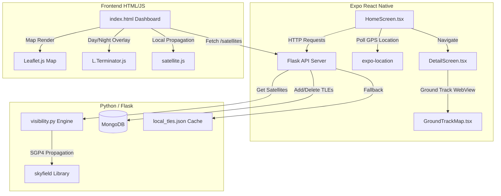

# SatTrack — Multi-Platform Satellite Tracking & Footprint Simulation System

SatTrack is a complete, multi-platform satellite tracking and visibility simulation ecosystem. The application computes high-fidelity satellite orbital mechanics in real-time, projects ground footprints, predicts pass timing, and suggests coordinates for nearest visibility.

This project is split into two primary components:
1. **Python Flask Backend & Web Dashboard:** A lightweight REST API for satellite propagation and database management, paired with a web-based Leaflet tracking dashboard.
2. **Expo React Native Mobile Client:** A modern, cross-platform iOS and Android mobile app designed to poll real-time visibility from the user's current GPS location and display interactive ground track overlays.

---

## 1. System Architecture



---

## 2. Directory Structure

```text
Satellite Track Demo Application/
├── Sattrack/                       # Backend (Python Flask) & Web Dashboard
│   ├── run.py                      # Flask Application entry point
│   ├── requirements.txt            # Python environment dependencies
│   ├── .env                        # Server configuration environment variables
│   └── sattrack/                   # Core Package files
│       ├── __init__.py             # Package initializer
│       ├── api.py                  # API endpoints and routes configuration
│       ├── visibility.py           # Core SGP4/Skyfield visibility calculations
│       ├── sample_tles.py          # Synthetic/Descriptive default TLE generator
│       ├── import_tles.py          # Script to fetch/import real TLEs from Celestrak
│       ├── seed_mongo.py           # Seeds MongoDB from the local JSON TLE cache
│       ├── local_tles.json         # Static JSON database containing ~1000+ TLE records
│       ├── static/                 # Static Assets (Leaflet.js, satellite.js, CSS)
│       └── templates/
│           └── index.html          # Interactive Web Dashboard template
│
└── sattrack-mobile/                # Frontend (React Native Expo App)
    ├── App.tsx                     # React Native app entrypoint & navigation setup
    ├── package.json                # Project dependencies and script shortcuts
    ├── tsconfig.json               # TypeScript configuration
    ├── .env                        # Mobile endpoint configuration
    └── app/                        # Main Application Code
        ├── components/             # Reusable UI elements (SatelliteCard, etc.)
        ├── constants/              # Style guidelines and design tokens (theme.ts)
        ├── hooks/                  # Logic custom hooks (useSatellites.ts)
        ├── screens/                # Core Application Screens
        │   ├── HomeScreen.tsx      # Satellite list and status dashboard
        │   └── DetailScreen.tsx    # Modal bottom-sheet with coordinates & maps
        └── types/                  # TypeScript interface declarations
```

---

## 3. Backend & Core Calculations (`sattrack/`)

The Python backend functions as both a REST API and a satellite propagation engine.

### A. Orbital Mechanics Calculations (`sattrack/visibility.py`)
This file houses `SatelliteVisibilityEngine` which executes the physics-heavy computations. 
*   **Propagation Model:** Utilizes `skyfield` and the standard SGP4 orbital model. It reads Two-Line Element (TLE) datasets, projects the current time epoch, and determines the satellite's position in Earth-Centered Inertial (ECI) coordinates.
*   **Topocentric Horizon Coordinates:** Calculates coordinates relative to the observer's location (latitude, longitude, altitude = 0).
    *   **Elevation (El):** Angle above the observer's local horizon. If elevation is greater than the configured threshold (default `10.0°`), the satellite is classified as **Visible** (i.e. the observer is within its signal footprint).
    *   **Azimuth (Az):** Compass bearing from the observer pointing towards the satellite's ground position (0° to 360° clockwise from North).
    *   **Range:** Absolute line-of-sight distance between the observer and the satellite in kilometers.
*   **Sub-Satellite Point (Ground Point):** Identifies the exact Latitude and Longitude coordinate on Earth directly underneath the satellite (`wgs84.subpoint`).
*   **Nearest Point of Visibility:** For satellites below the horizon, the engine runs a binary search along the great-circle arc from the observer pointing toward the sub-satellite point. It identifies the boundary coordinate where the satellite crosses the elevation threshold (minimum `10.0°`). It also outputs the absolute distance to this coordinate in kilometers (`distance_to_nearest_point_km`).
*   **Pass Timing & Predictions:** Computes when a currently visible satellite will set below the horizon, or when a hidden satellite will next rise above the observer's horizon (searching up to 24 hours into the future), along with the duration of the pass.

### B. Database & Fallback Layer (`sattrack/api.py`)
The server uses a dual-layer data storage configuration:
1.  **MongoDB Database:** Stores active satellite records as documents containing `name`, `line1` (TLE line 1), and `line2` (TLE line 2).
2.  **Local JSON Fallback:** If MongoDB is unavailable or fails to connect, the server automatically reads from [local_tles.json](file:///c:/Users/trgb/Satellite%20Track%20Demo%20Application/Sattrack/sattrack/local_tles.json) to ensure the app continues to operate.

### C. API Endpoints
*   **`GET /satellites`**
    *   **Parameters:** `lat` (float), `lon` (float), `search` (string, optional), `limit` (int)
    *   **Output:** Returns a list of processed satellites sorted by visibility (visible first, then by proximity to the visibility footprint), including sub-point coordinates, look angles, next-pass predictions, and TLE strings.
*   **`POST /satellites/manage`**
    *   **Payload:** `{ "name": "...", "line1": "...", "line2": "..." }`
    *   **Action:** Upserts (adds or updates) a satellite's TLE record in MongoDB and synchronizes the local cache.
*   **`DELETE /satellites/manage/<name>`**
    *   **Action:** Deletes the specified satellite from both the database and the local cache.

---

## 4. Web Dashboard (`sattrack/templates/index.html`)

The web dashboard is an interactive, responsive HTML/JS application served by Flask.

### Key Layout Features:
*   **Observer Location Panel:** Allows manually inputting observer latitude and longitude or using HTML5 Geolocation API (`Detect Location` button) to get the browser's coordinates.
*   **Search Box:** Filters the list of satellites in real-time.
*   **Dynamic Sidebar List:** Displays cards for each satellite showing its name, real-time elevation, altitude, and a status badge (`Visible` in green / `Not Visible` in grey). The list is synchronized and automatically refreshed every 5 seconds to prevent stale data.
*   **Leaflet Interactive Map:**
    *   **Base Map Layer:** Rendered using OpenStreetMap tiles.
    *   **Observer Marker:** Red dot indicating the observer's physical coordinates.
    *   **Selected Satellite:** A custom blue SVG icon showing the satellite's position, with a pulsing radar wave effect.
    *   **Visibility Footprint:** A transparent blue circle centered on the satellite showing its signal reach.
    *   **Ground Track (Orbit):** An amber line overlay representing the orbital path (both past and future orbit segments).
    *   **Day/Night Terminator:** A dynamic, sinusoidal dark mask (`L.Terminator.js`) showing which regions of the Earth are currently experiencing nighttime.
*   **Real-Time Metrics Floating Panel:** Displays coordinates (Lat, Lon), altitude, velocity, and look angles (Elevation, Azimuth) for the selected satellite.
*   **Timeline Simulation Slider:** Allows scrubbing time forward or backward up to 90 minutes. When dragged, the application shifts the simulation clock and propagates the orbital path dynamically using standard `satellite.js` on the client. A "Resume Live" button appears to return to standard clock time.

---

## 5. Mobile App (`sattrack-mobile/`)

The mobile client is built on Expo and TypeScript, designed to function as a field utility.

### A. HomeScreen (`app/screens/HomeScreen.tsx`)
*   **Tracking Toggle:** A master switch enables or disables tracking. When off, a clean interface informs the user to toggle the switch. When active, it triggers the location polling loop.
*   **GPS Integration:** Automatically requests foreground GPS permissions via `expo-location` and retrieves device coordinates.
*   **Filtering & Refreshing:** Includes a search input to look up satellites by name, pull-to-refresh functionality, and an explicit refresh menu option in the top right.
*   **Two-Section List:** Groups satellites into:
    *   *Visible Satellites:* Currently passing over the user's location (elevation >= 10°).
    *   *Not Currently Visible:* Sorted by proximity to the user's location.

### B. DetailScreen (`app/screens/DetailScreen.tsx`)
Rendered as a premium transparent overlay modal that slides up from the bottom when clicking the `i` (info) icon in the sidebar:
*   **Real-Time Stats:** Displays the satellite's instantaneous elevation, azimuth, range, and altitude.
*   **Ground Track Mini-Map (`app/components/GroundTrackMap.tsx`):** Renders an embedded map component showcasing the satellite's path, the observer's position, and the current footprint.
*   **Dynamic countdowns & passes:**
    *   *If Visible:* Renders a real-time ticking clock showing the remaining minutes and seconds before the satellite sets.
    *   *If Not Visible:* Displays when the next pass will start in UTC time, and how long the visibility pass will last when it does.

---

## 6. Execution & Setup Instructions

### Backend (Python Flask Server)
1.  **Activate Virtual Environment:**
    ```powershell
    .\venv\Scripts\activate
    ```
2.  **Install Required Libraries:**
    ```powershell
    cd Sattrack
    pip install -r requirements.txt
    ```
3.  **Import TLE Data:**
    ```powershell
    python sattrack/import_tles.py
    ```
4.  **Start Flask API Server:**
    ```powershell
    python run.py
    ```
    *   Dashboard url: `http://localhost:5002`

### Mobile Client (Expo React Native)
1.  **Install Client Dependencies:**
    ```powershell
    cd sattrack-mobile
    npm install
    ```
2.  **Configure API Endpoint:**
    *   Create a `.env` file in the `sattrack-mobile/` folder:
        ```env
        EXPO_PUBLIC_API_BASE_URL=http://<YOUR_PC_WIFI_IP>:5002
        ```
3.  **Start Development Server:**
    ```powershell
    npx expo start
    ```
    *   Scan the QR code with your mobile device (must be connected to the same Wi-Fi network) or press `a` for Android Emulator / `i` for iOS Simulator.
